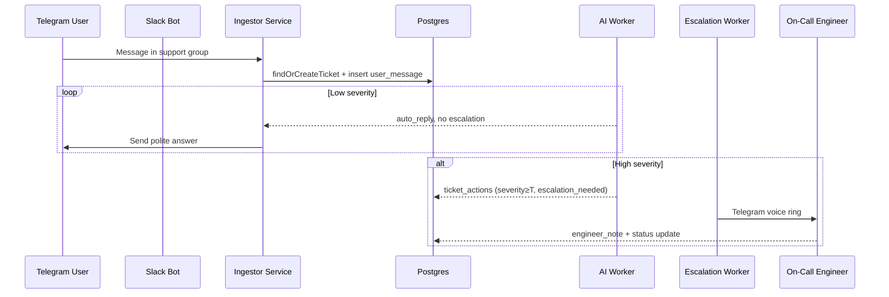

# Shift-Bot Support Platform – High-Level Specification

> This document captures WHAT the system must do and WHY, not HOW.  Developers can fill in implementation details as they build.

---

## 1. Purpose

Provide a unified, near-real-time workflow for handling customer-reported bugs coming in from Telegram (end-users) and Slack (internal teams), with on-call escalation, AI triage, and an engineer dashboard.

---

## 2. Major Capabilities

1. **Multi-platform Ingestion**
   - Listen to designated Telegram groups/channels and Slack channels (config-driven list).
   - Normalise every incoming message into a common schema and persist to the database.

2. **Ticket Lifecycle Management**
   - Auto-create a `ticket` on first message; subsequent messages in the same Slack thread / Telegram reply chain attach to that ticket.
   - Track status: `open » auto_answered » awaiting_feedback » escalation_pending » escalated » closed`.
   - Immutable `ticket_actions` journal records every event (user message, LLM answer, escalation call, engineer note, system update).

3. **AI Triage (LLM)**
   - Summarise the conversation so far.
   - Classify severity (0-1) and decide if immediate escalation is needed.
   - Generate courteous automated replies for low-severity issues.

4. **Escalation Engine**
   - Identify the current on-call engineer.
   - Place a Telegram voice ring (or phone call) when a ticket moves to `escalation_pending`.
   - Record outcome in `ticket_actions` (`escalation_call`).

5. **Shift / On-Call Management**
   - CRUD for engineers (contact handles, phone).  
   - Toggle `is_on_call` via dashboard or API.
   - Enforce single engineer on-call at a time (soft lock / validation).

6. **Engineer Dashboard (Web, Vite+Express or Next.js)**
   - Real-time feed of tickets grouped by status.
   - Detail view with full `ticket_actions` timeline and AI thinking.
   - Controls: acknowledge escalation, leave notes, close ticket, toggle on-call.

7. **Notifications & Integrations**
   - Post AI replies back into the originating platform (Slack thread / Telegram chat).
   - Optional email/SMS fallback if Telegram call fails.

8. **Observability & Ops**
   - Health endpoints, Prometheus metrics (tickets per hour, escalations, LLM latency).
   - Structured logging throughout (JSON).

9. **Security & Auth**
   - API routes protected via OAuth2 introspection.
   - Front-end authenticated via existing SSO provider.

10. **Configurability**
    - `sources.json` file governs which channels/groups are monitored and whether they are active.
    - `.env` controls platform tokens, feature flags (enable_LLM), concurrency limits, etc.

---

## 3. Data Model (Supabase / Postgres)

- **engineers** – contact details, on-call flag.
- **tickets** – one row per bug thread.
- **ticket_actions** – append-only timeline.
- Enum types: `platform`, `ticket_status`, `action_type`, `escalation_method`.

(See `supabase/migrations/0001_create_support_schema.sql`.)

---

## 4. High-Level Flow

---

## 5. Non-Goals (v1)

- Billing / SLA tracking
- Multi-language support
- Full-duplex Telegram voice
- Fancy analytics beyond basic metrics

---

## 6. Open Questions

1. What’s the precise threshold for auto-escalation?  (Config param.)
2. Do we need retries if the Telegram call is rejected?
3. How long do we persist logs (GDPR / retention)?
4. Who manages engineer accounts—self-service or admin-only?

---

## 7. Roadmap Snapshot

1. **DONE**  – Ingestion pipeline → tickets/actions.  
2. **NEXT**  – TicketService layer for status transitions.  
3. **THEN**  – LLM triage stub & escalation worker.  
4. **LATER**  – Shift UI + dashboard, observability, security hardening. 